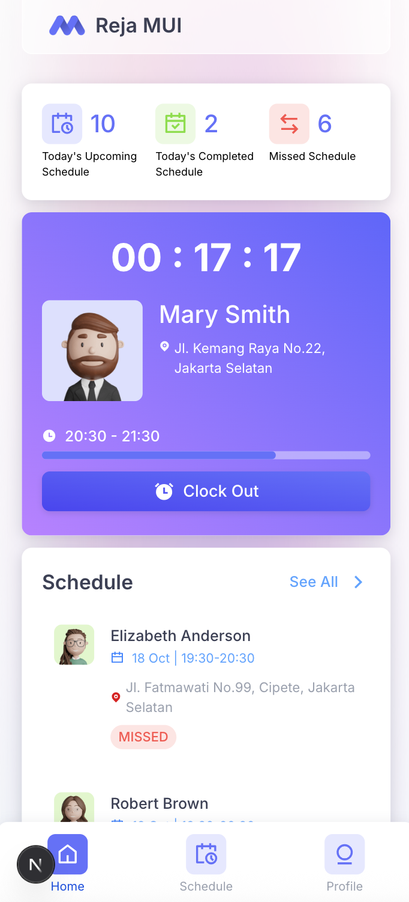
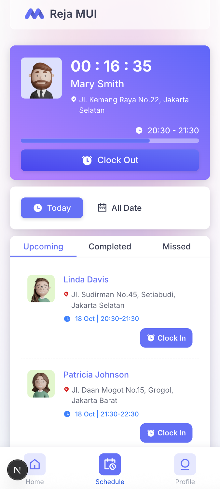
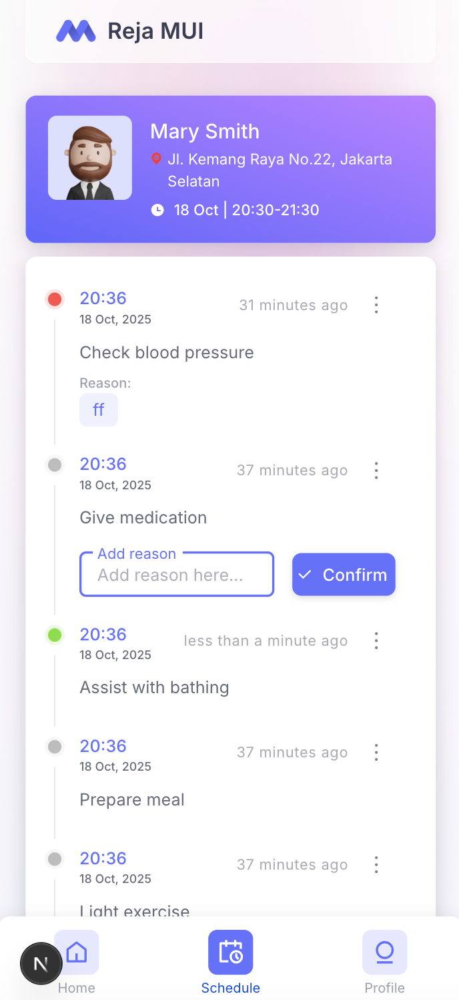
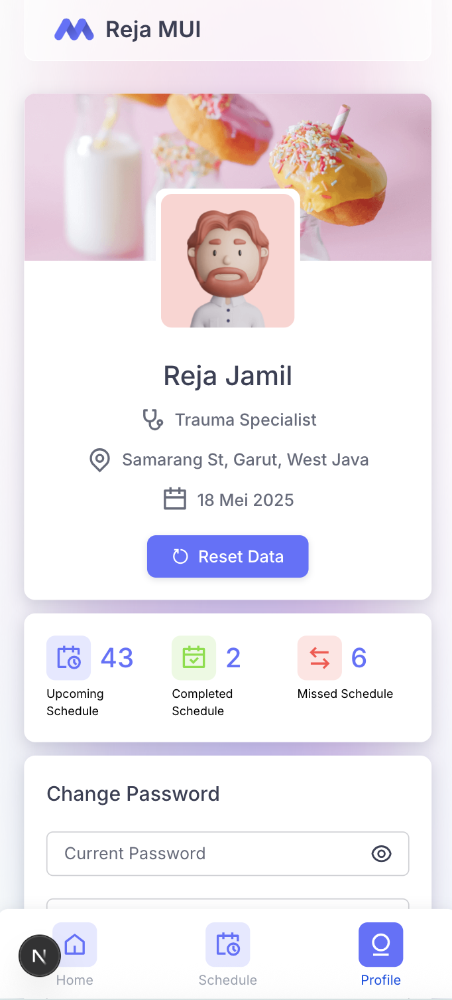
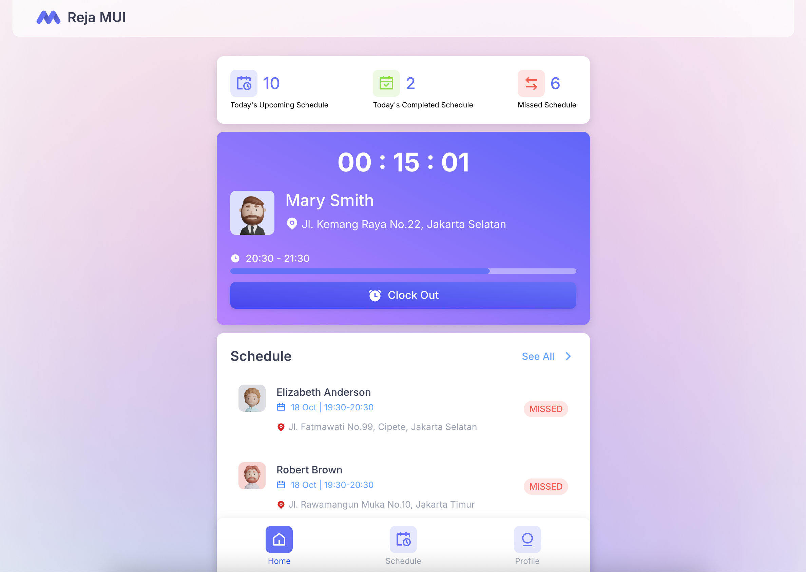
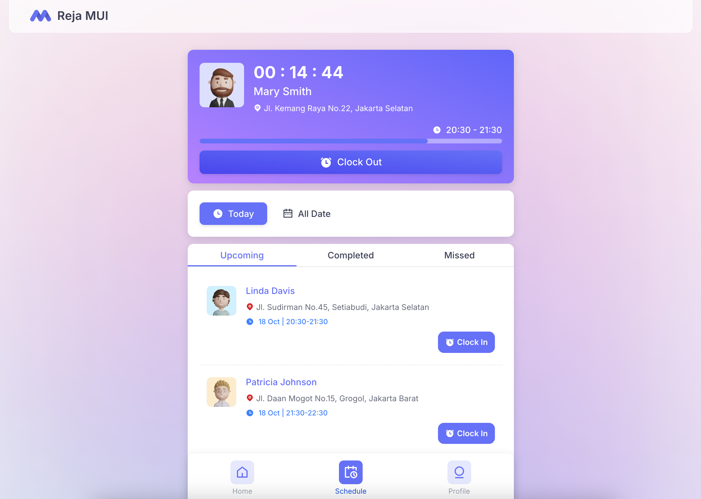
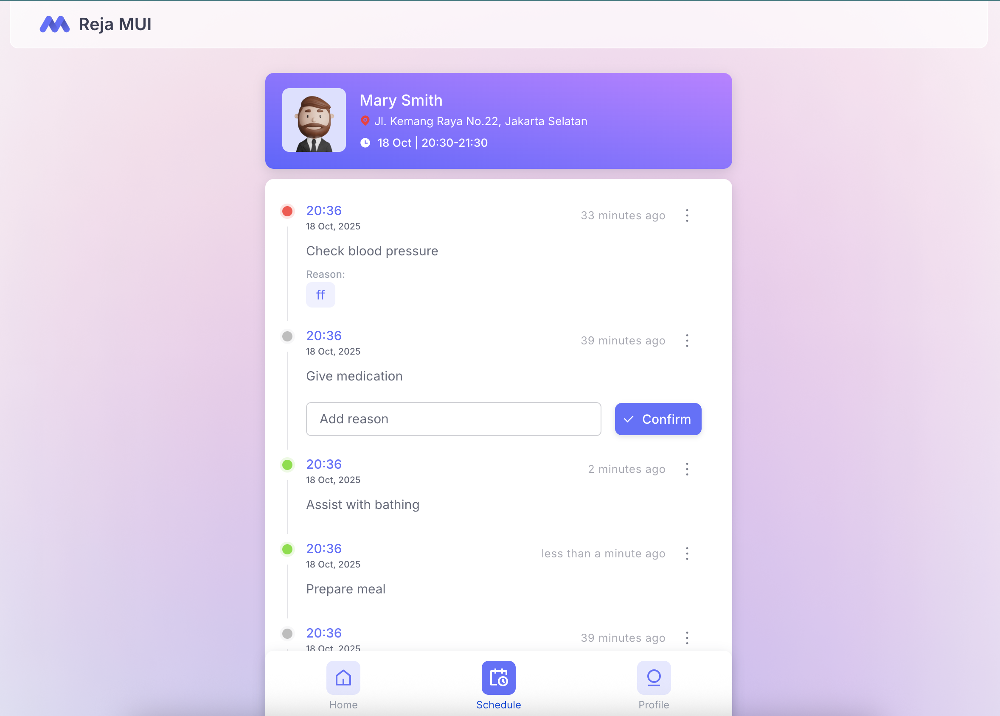
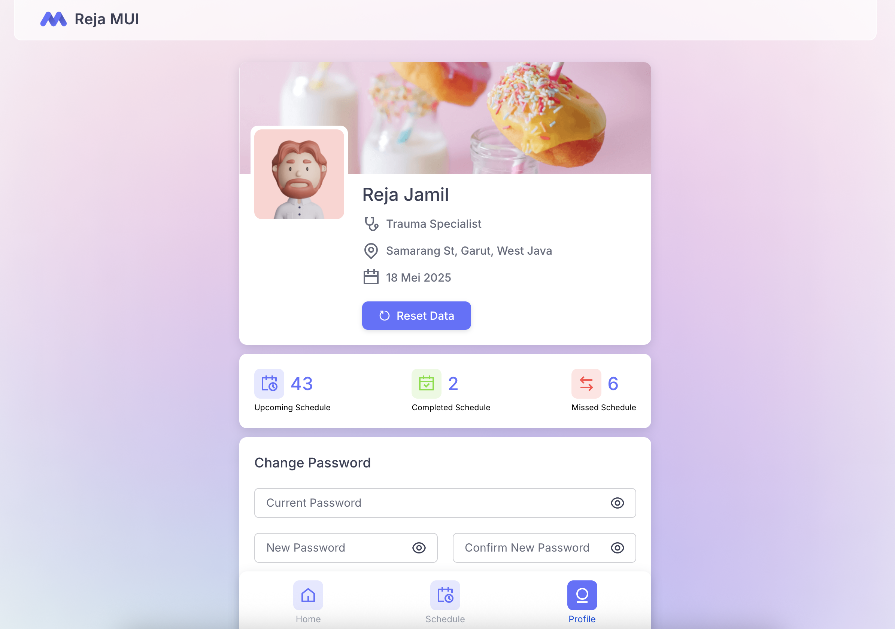

# Next.js Project

This is a [Next.js](https://nextjs.org/) project bootstrapped with [`create-next-app`](https://github.com/vercel/next.js/tree/canary/packages/create-next-app).

## Getting Started

### 1. Setup Environment Variables

Create a `.env` file in the root directory of your project and add the following line:

```bash
NEXT_PUBLIC_API=http://localhost:4000
```

> This variable is used to define the base URL for your API requests.

### 2. Run the Development Server

After setting up your `.env` file, start the development server by running one of the following commands:

```bash
npm run dev
# or
yarn dev
# or
pnpm dev
```

Open [http://localhost:3000](http://localhost:3000) in your browser to see the result.

You can start editing the page by modifying `app/page.tsx`. The page auto-updates as you edit the file.

This project uses [`next/font`](https://nextjs.org/docs/basic-features/font-optimization) to automatically optimize and load Inter, a custom Google Font.

---

## 🔄 Resetting Data

If you need to **reset your data**, there are two ways to do it:

1. **From the backend project**  
   Go to your backend project folder and run the following command:

   ```bash
   yarn seed
   ```

   This will re-seed the database with default data.

2. **From the frontend UI**
   - Open the app in your browser
   - Go to the **Profile** page
   - Click the **Reset Data** button

Either method will restore your data to its initial state.

---

## 📱 App Screenshots

### 🧭 Mobile View

| Home                                              | Schedule                                                  | Task                                              | Profile                                                 |
| ------------------------------------------------- | --------------------------------------------------------- | ------------------------------------------------- | ------------------------------------------------------- |
|  |  |  |  |

### 💻 Desktop View

| Home                                                | Schedule                                                    | Task                                                | Profile                                                   |
| --------------------------------------------------- | ----------------------------------------------------------- | --------------------------------------------------- | --------------------------------------------------------- |
|  |  |  |  |

---

## Learn More

To learn more about Next.js, take a look at the following resources:

- [Next.js Documentation](https://nextjs.org/docs) - learn about Next.js features and API.
- [Learn Next.js](https://nextjs.org/learn) - an interactive Next.js tutorial.

You can check out [the Next.js GitHub repository](https://github.com/vercel/next.js/) - your feedback and contributions are welcome!

---

## Deploy on Vercel

The easiest way to deploy your Next.js app is to use the [Vercel Platform](https://vercel.com/new?utm_medium=default-template&filter=next.js&utm_source=create-next-app&utm_campaign=create-next-app-readme) from the creators of Next.js.

Check out our [Next.js deployment documentation](https://nextjs.org/docs/deployment) for more details.
